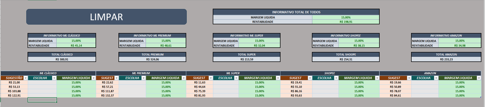

# 📊 Marketplace Margin Simulator

Simulador profissional de **precificação e análise de margem para marketplaces**, desenvolvido em Excel com foco em tomada de decisão estratégica.

Ferramenta criada para empresas que precisam entender o **lucro real por canal de venda** antes de anunciar.

---

## 🚀 Funcionalidades

- Cálculo de margem bruta e líquida  
- Simulação de preço ideal de venda  
- Comparação entre marketplaces  
- Indicador de rentabilidade por canal  
- Consolidação total de resultados  
- Análise por produto ou portfólio  

---

## 🛒 Marketplaces suportados

- Mercado Livre (Clássico, Premium, Full / Super)  
- Shopee  
- Amazon  

---

## 🎯 Problema que resolve

Grande parte dos sellers define preço sem visualizar o impacto real de:

- Comissão do marketplace  
- Taxas logísticas  
- Impostos  
- Custo do produto  
- Frete e despesas operacionais  

O simulador entrega o **lucro real antes da decisão de venda**, permitindo escolha estratégica do melhor canal.

---

## 🎥 Vídeo de demonstração e uso

Vídeo explicativo demonstrando o funcionamento do simulador, fluxo de utilização e lógica de análise de margem e precificação.

🔗 Acessar vídeo:
https://drive.google.com/file/d/17rXjmQGNlr78ZloFb-2pfEluziw_E-Um/view?usp=drive_link

---

## 📸 Demonstração

### Tela inicial

### Tela de cálculos e comparativos

---

## 🧠 Sobre o Desenvolvedor

Desenvolvido por **Christopher Benini**

Especialista em:

- Automação para varejo  
- Extração e tratamento de dados  
- Integração Excel + SQL  
- Desenvolvimento de ferramentas desktop  
- Otimização de processos operacionais  

Atuação focada em transformar processos manuais em soluções práticas e utilizáveis pelo time operacional.

---

## 🔒 Produto Comercial

Este repositório contém apenas demonstração visual.

A planilha completa é disponibilizada como solução personalizada para empresas, com:

- Parametrização de taxas reais  
- Ajuste conforme regime tributário  
- Customização conforme modelo operacional  
- Orientação de uso  

---

## 📩 Contato

**Christopher Benini**  
📧 Email: chrisbenini13@gmail.com  
📱 WhatsApp: (17) 98147-8331  
🔗 GitHub: https://github.com/chrisbenini  

---
