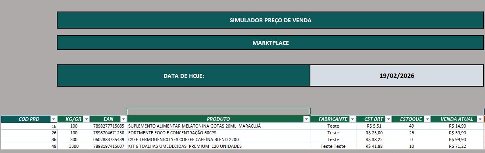
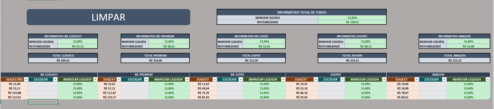

  

Simulador desenvolvido em <b>Excel</b> para calcular o <b>lucro real</b> e definir o <b>melhor preço de venda</b> em marketplaces.

  
  
  
  

---

## `> what_is_this`

Ferramenta criada para responder uma pergunta simples:

👉 **"Vale a pena vender esse produto?"**

O simulador calcula automaticamente custos, taxas e comissões para mostrar o **lucro real antes da venda**.

---

## `> marketplaces`

---

## `> features`

✔ cálculo automático de margem  
✔ simulação de preço ideal  
✔ comparativo entre marketplaces  
✔ indicador de rentabilidade  
✔ análise por produto ou portfólio  

---

## `> preview`

---

## `> demo`

<a href="https://drive.google.com/file/d/17rXjmQGNlr78ZloFb-2pfEluziw_E-Um/view?usp=drive_link">
▶ Assistir demonstração do simulador
</a>

---

## `> tech_stack`

---

## `> author`

**Christopher Benini**

  

---

⭐ Se o projeto foi útil, considere deixar uma estrela!
